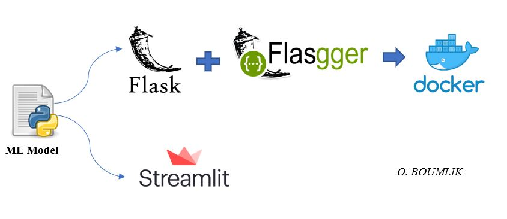
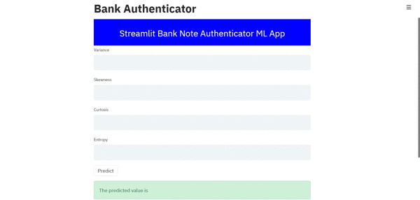

# Bank Note Authentication UCI data

---

## Description

This project covers:
-   Creating a simple Random Forest classifier for Note Bank Authentification using [ UCI DATA](https://www.kaggle.com/ritesaluja/bank-note-authentication-uci-data)
-   Building a flask app based on the classifier.
-   Deploying the Machine Learning Model Using Flask And Flasgger.
-   Writing, Building, And Running Docker Image.
-   Deploying the App Using StreamLit Library.

---
## To run the APP: 

1. Clone this repository in your local system.
2. Install all the libraries mentioned in the requirements.txt file.
3. Open the command prompt from your project directory and run :

   **The continairized Flask App** :  
       ==> Build the docker image:  docker build -t bank_api .  
       ==> Run the bank note authenticator App : docker run -p 8000:8000 bank_api
       
       NB: Ckeck your default IP adress/apidocs and the output should be as follow:
       
   
       
   **The Streamlit App** : streamlit run streamlit_app.py
        
   
---

## References

https://towardsdatascience.com/deploy-machine-learning-pipeline-on-cloud-using-docker-container-bec64458dc01

https://flask.palletsprojects.com/en/1.1.x/

https://github.com/flasgger/flasgger

https://www.streamlit.io/

